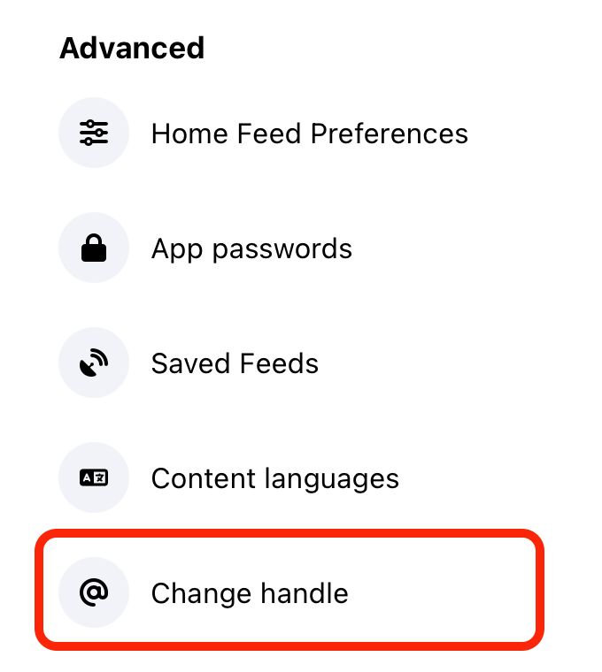
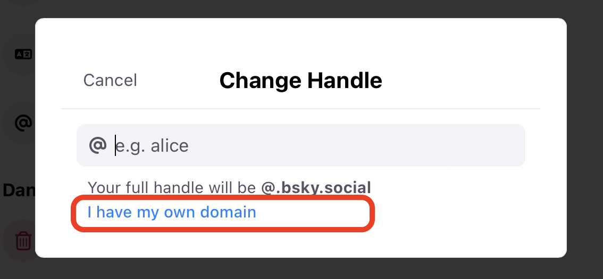
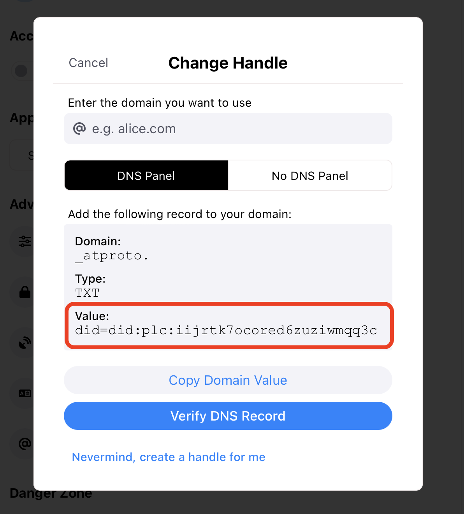
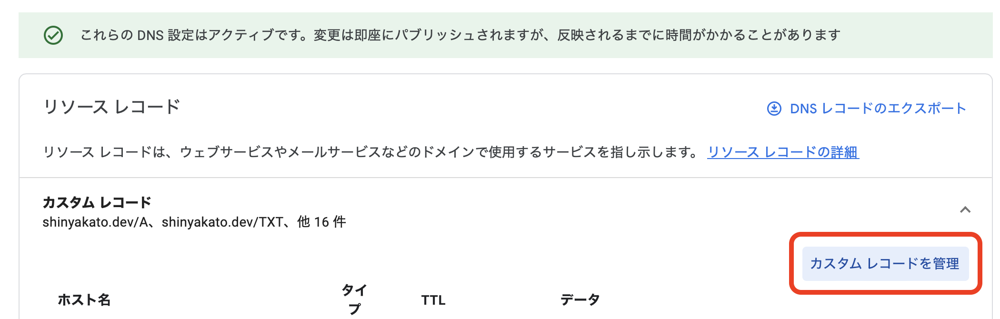
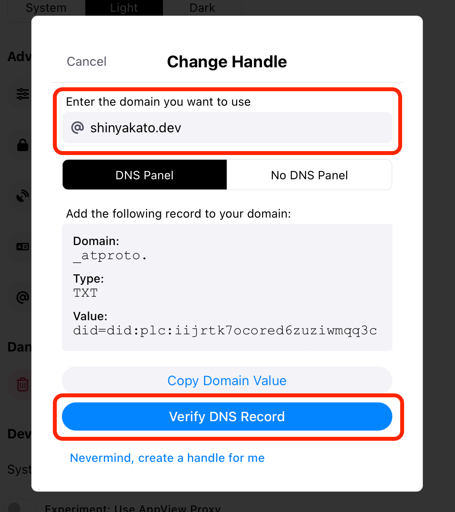
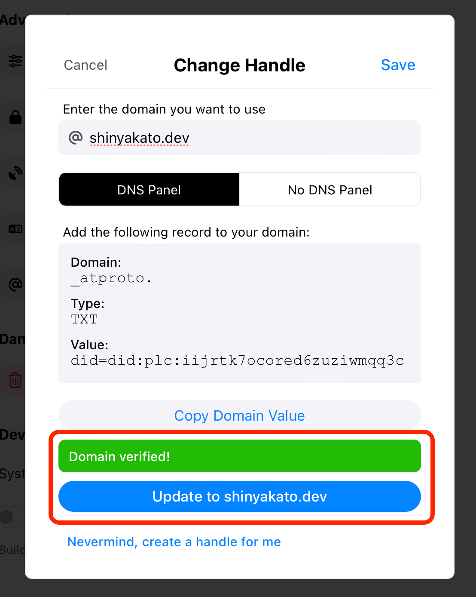

# カスタムドメイン

## 概要

Bluesky SocialはAT Protocolを基盤に構築されており、**あなたが所有しているドメインをアカウントのハンドルとして設定することができます**。
アカウントを登録した際に付けられた`xxx.bsky.social`のようなハンドルのままでもBluesky Socialを使う際には何も問題はありませんが、カスタムドメインを設定することで次の利点があります。

- **ドメインに関連付けられているWebサービス等を通じて、アカウントの持ち主が本物であることを証明することができます。** 例えば、日本の衆議院議員である河野太郎氏を例に考えてみましょう。河野太郎氏が今までにBluesky Socialにアカウントを作成した事実はありませんが、仮に河野太郎氏が「`tarokono.bsky.social`」というアカウントを作成したとして、どうやってこのアカウントの持ち主が本物の河野太郎氏であると証明できるでしょうか？Bluesky Socialにおけるこの問題の最も確実な解決策は、河野太郎氏または河野太郎氏の組織が所有しているドメインである「`taro.org`」を「`tarokono.bsky.social`」の代わりにアカウントのハンドルとして設定することです。なぜなら、「`taro.org`」のドメインを所有しているのは河野太郎氏または河野太郎氏の組織以外にはあり得ず、「`taro.org`」のドメインをアカウントのハンドルに設定できるのは河野太郎氏または河野太郎氏の組織だけだからです。
- **常に同じハンドルでユーザーはあなたを複数サービスで確実に識別できます。** あなたは新しいサービスを開始する際に、他のサービスで使用しているハンドル名が既に誰かに使われているといった経験をしたことはないでしょうか？カスタムドメインを使用してあなたが所有しているドメインをハンドルとして使用することで、この問題は完全に過去のものになります。AT Protocolを基盤としたサービスにおいてドメインをハンドルとして設定することで、あなたはあなたが所有しているドメインによって自己の存在の確からしさを証明し、そしてあなた以外のユーザーもあなたが本物であることを確実に識別することができます。つまり、あなたが所有するドメインはあなたが手放さない限り、AT Protocolにおいて常にあなただけのハンドルになります。

:::info
カスタムドメインを使用したハンドルは、オンライン上のソーシャル・アイデンティティに対するユーザーの信頼と管理の状態を改善するための方法です。これはWebサイトの命名システムであるDNSの既存のインフラを基盤としています。
:::

:::caution
あなたが所有するドメインをハンドルとして設定した時点で、あなたのアカウントの過去の`xxx.bsky.social`といったハンドルは誰もが取得できる状態になる点に注意してください。
:::

## 設定方法

Bluesky Socialでカスタムドメインを設定する方法はとても簡単です。次の手順に従ってください。

:::info
**[公式のWebクライアント](https://bsky.app)**を使用して記述しますが、AndroidやiOSのモバイルアプリについても操作方法は同じです。

また、カスタムドメインを設定する際にDNSの設定が必要になりますが、あなたが所有しているドメインの管理サービスに応じて設定を行ってください。今回の例ではGoogle Domainsの設定画面を例として使用します。
:::

### 1. `Settings`を開く

### 2. `Advanced`セクションの`Change handle`を押す

### 3. `I have my own domain`リンクを押す

### 4. `did=`で始まる文字列をコピーする

ここまでの工程で上記の画面が出力されたと思いますので、赤枠の`Value:`の下にある`did=`で始まる文字列をコピーしてください。上記の画像の例だと`did=did:pic:iijrtk7ocored6zuziwmqq3c`をコピーすることになります。ここでコピーした値は[次のセクション](#5-dnsを設定する)でDNSを設定する際に使用します。

### 5. DNSを設定する

:::info
カスタムドメインの設定において、このDNSを設定するセクションが最も難しいです。
ただ、次の手順を順番に行えば必ず設定できますので、落ち着いて読み進めてください。
:::

あなたが所有するドメインの管理サービスにログインし、DNSの設定画面を開いてください。今回の例ではGoogle Domainsの設定画面を使用しますが、どのサービスであってもDNSの設定で違いはありませんので同じように設定してください。

Google Domainsの場合は、まず`DNS`のメニューを押してください。

次に、`カスタムレコードを管理`ボタンを押してください。

そうすると、レコードの入力画面が出力されると思うので、次のように入力してください。

上記画像の入力項目をよりわかりやすく整理したのが次のテーブルです。

| フィールド名 | 値                                                                                                        |
| ------------ | --------------------------------------------------------------------------------------------------------- |
| **ホスト名** | _atproto                                                                                                  |
| **タイプ**   | TXT                                                                                                       |
| **TTL**      | 3600                                                                                                      |
| **データ**   | [先の工程](#4-didで始まる文字列をコピーする)でBluesky公式クライアントからコピーした`did=`で始まる文字列。 |

ここまで入力できたら、`保存`を押してカスタムレコードを反映してください。以上でDNSの設定は完了です。

### 6. BlueskyでDNS認証する

[DNSの設定](#5-dnsを設定する)が完了したら、Blueskyの公式クライアントの`Change Handle`画面に戻ってください。次の画像の画面です。

まず、上記の画像の`Enter the domain you want to use`の直下にある入力フィールドにあなたがハンドルとして設定したいドメインを入力してください。次に、画面の下部にある`Verify DNS Record`ボタンを押してください。

もしあなたが設定したDNSレコードの設定が正しい場合は、`Verify DNS Record`ボタンを押した後で上記画像のように`Domain verified!`メッセージが出力されます。あとは、`Update to xxxxx`ボタンを押すとあなたが設定したドメインがハンドルしてアカウントに設定されます。

:::tip
もしDNS認証で失敗する場合は、DNSレコードの設定が反映されるまで数分ほど待つか、[DNSレコードの設定](#5-dnsを設定する)を見直してください。
:::
