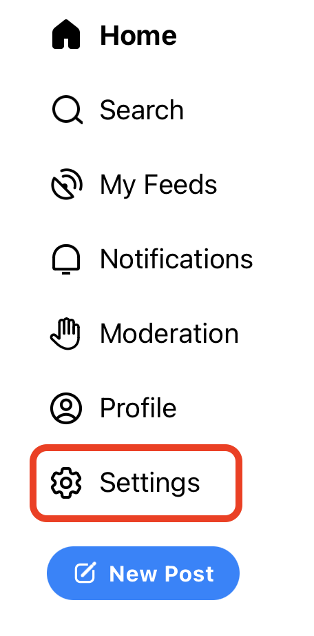
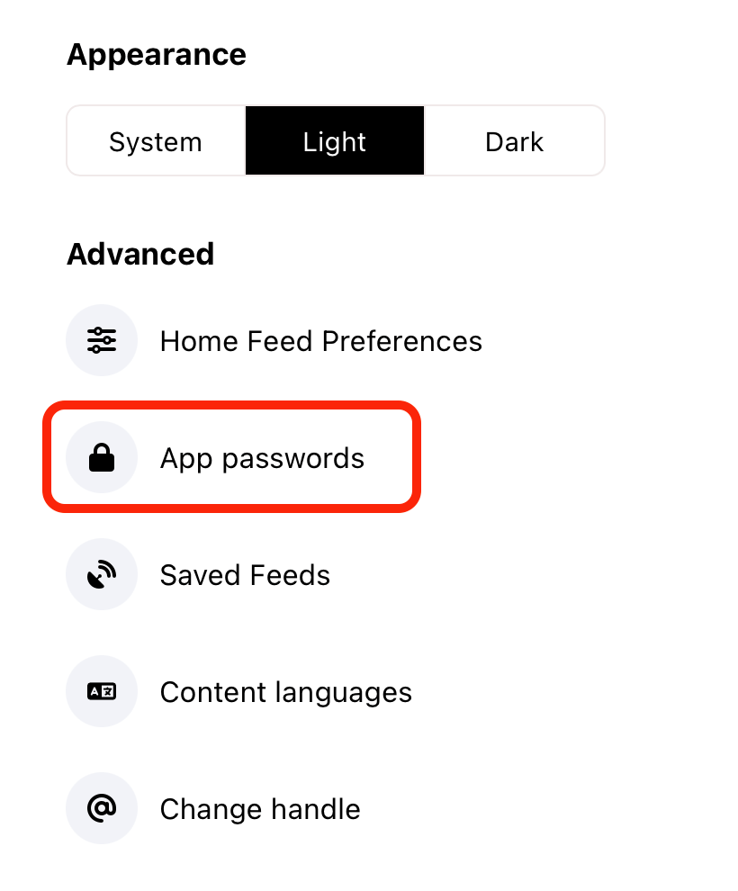
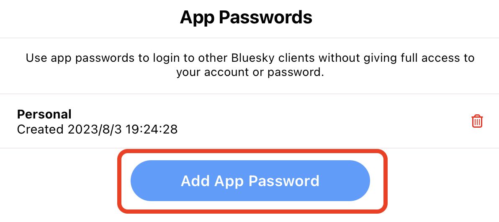
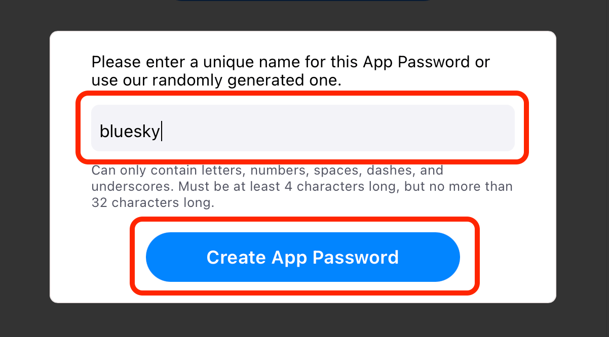
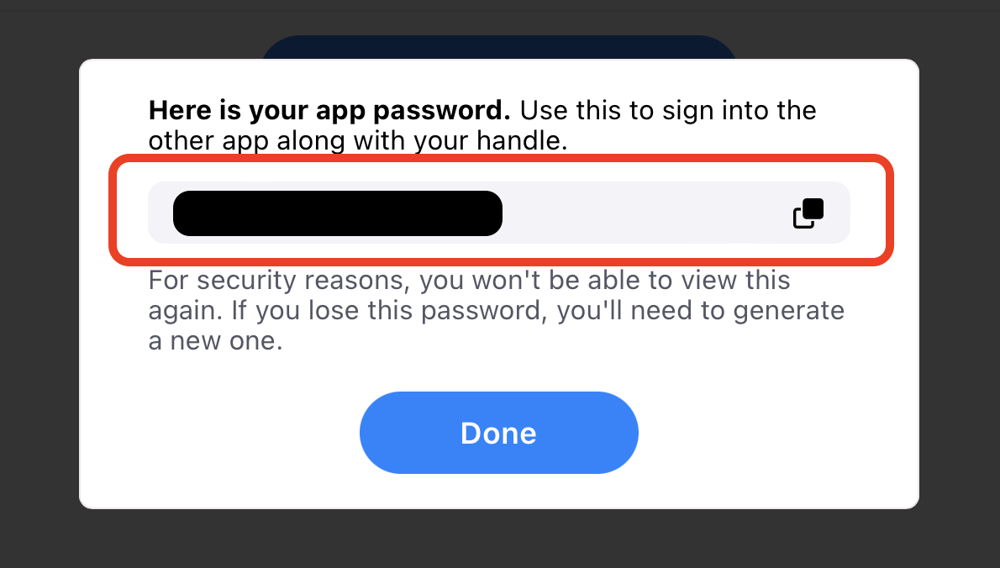
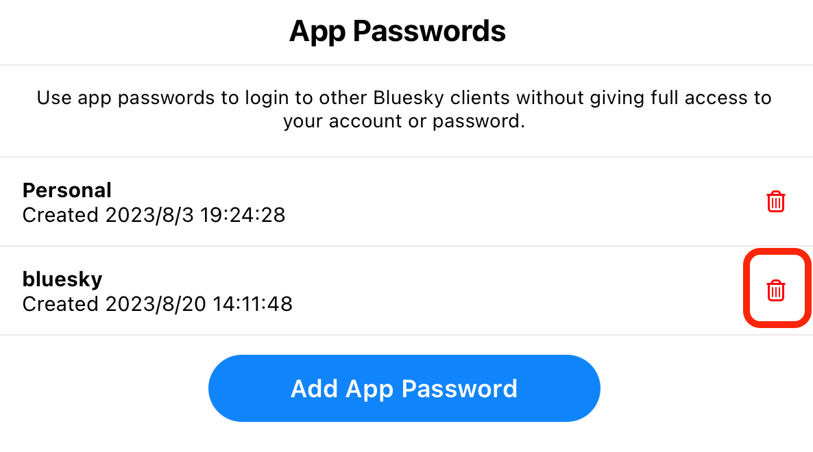

# パスワードの取り扱い

:::danger 必読

Bluesky 特有のパスワードの取り扱いについて記載しています。非公式ツール等を使用する際に App Password を使用していない方は読まれることを **強く** お勧めします。

:::

## App Password

App Passwordは、ユーザーのアカウントパスワードとほとんど同じ権限を持ちますが、アカウントの削除やアカウントの移行などの破壊的なアクションは制限されています。また、追加のApp Passwordを作成することも制限されています。

そのため、もしあなたがサードパーティのクライアントを使用する場合や、APIを使用してアプリを開発する際にはApp Passwordを使用することが**強く推奨されています**。

### 公式クライアントから作成する方法

- [https://bsky.app](https://bsky.app)

:::info
公式のWebクライアントを使用して記述しますが、AndroidやiOSのモバイルアプリについても操作方法は同じです。
:::

#### 1. `Settings`を開く

#### 2. `Advanced`セクションから`App passwords`ボタンを押す

#### 3. `Add App Password`ボタンを押す

#### 4. App Password の名前を入力して`Create App Password`を押す

:::tip
App Passwordの名前に入力できるのは以下の文字だけです。

- **英字**
- **数字**
- **スペース**
- **ダッシュ（"-"）**
- **アンダースコア（"_"）**

また、許容される文字数は **_4文字以上32文字以内_** です。
:::

#### 5. 生成されたApp Passwordをコピーして安全な場所に保存する

:::danger
生成されたApp Passwordは **_絶対_** に他者と共有しないでください。

もしあなたが作成したApp Passwordがなんらかの理由で他者に使用されたと思われる場合は、速やかに以下のように該当のApp Passwordを削除してください。
また、不要になったApp Passwordや、紛失したApp Passwordについても削除するようにしてください。

:::
